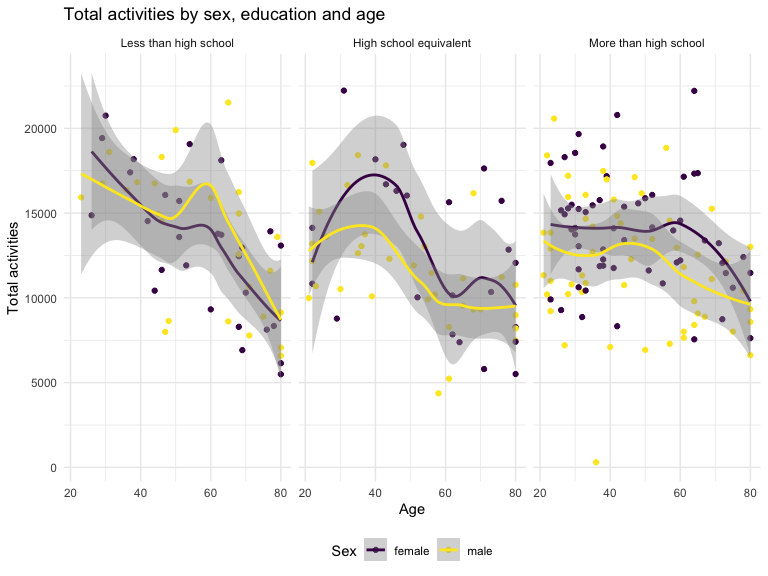

Homework 3
================
Yingting Zhang
2023-10-11

``` r
library(tidyverse)
```

    ## ── Attaching core tidyverse packages ──────────────────────── tidyverse 2.0.0 ──
    ## ✔ dplyr     1.1.3     ✔ readr     2.1.4
    ## ✔ forcats   1.0.0     ✔ stringr   1.5.0
    ## ✔ ggplot2   3.4.3     ✔ tibble    3.2.1
    ## ✔ lubridate 1.9.2     ✔ tidyr     1.3.0
    ## ✔ purrr     1.0.2     
    ## ── Conflicts ────────────────────────────────────────── tidyverse_conflicts() ──
    ## ✖ dplyr::filter() masks stats::filter()
    ## ✖ dplyr::lag()    masks stats::lag()
    ## ℹ Use the conflicted package (<http://conflicted.r-lib.org/>) to force all conflicts to become errors

``` r
library(ggridges)
library(patchwork)
```

# Question 1

``` r
library(p8105.datasets)
data("instacart")

knitr::opts_chunk$set(
    echo = TRUE,
    warning = FALSE,
    fig.width = 8, 
  fig.height = 6,
  out.width = "90%"
)

theme_set(theme_minimal() + theme(legend.position = "bottom"))

options(
  ggplot2.continuous.colour = "viridis",
  ggplot2.continuous.fill = "viridis"
)

scale_colour_discrete = scale_colour_viridis_d
scale_fill_discrete = scale_fill_viridis_d
```

### Due date

Due: October 14 at 4:00pm.

### Points

| Problem         | Points    |
|:----------------|:----------|
| Problem 0       | 20        |
| Problem 1       | –         |
| Problem 2       | 40        |
| Problem 3       | 40        |
| Optional survey | No points |

### Problem 0

This solution focuses on a reproducible report containing code and text
necessary for Problems 1-3, and is organized as an R Project. This was
not prepared as a GitHub repo; examples for repository structure and git
commits should be familiar from other elements of the course.

Throughout, we use appropriate text to describe our code and results,
and use clear styling to ensure code is readable.

### Problem 1

#### Read in the data

``` r
data("instacart")

instacart = 
  instacart |> 
  as_tibble()
```

#### Answer questions about the data

This dataset contains 1384617 rows and 15 columns, with each row
resprenting a single product from an instacart order. Variables include
identifiers for user, order, and product; the order in which each
product was added to the cart. There are several order-level variables,
describing the day and time of the order, and number of days since prior
order. Then there are several item-specific variables, describing the
product name (e.g. Yogurt, Avocado), department (e.g. dairy and eggs,
produce), and aisle (e.g. yogurt, fresh fruits), and whether the item
has been ordered by this user in the past. In total, there are 39123
products found in 131209 orders from 131209 distinct users.

Below is a table summarizing the number of items ordered from aisle. In
total, there are 134 aisles, with fresh vegetables and fresh fruits
holding the most items ordered by far.

``` r
instacart |> 
  count(aisle) |> 
  arrange(desc(n))
```

    ## # A tibble: 134 × 2
    ##    aisle                              n
    ##    <chr>                          <int>
    ##  1 fresh vegetables              150609
    ##  2 fresh fruits                  150473
    ##  3 packaged vegetables fruits     78493
    ##  4 yogurt                         55240
    ##  5 packaged cheese                41699
    ##  6 water seltzer sparkling water  36617
    ##  7 milk                           32644
    ##  8 chips pretzels                 31269
    ##  9 soy lactosefree                26240
    ## 10 bread                          23635
    ## # ℹ 124 more rows

Next is a plot that shows the number of items ordered in each aisle.
Here, aisles are ordered by ascending number of items.

``` r
instacart |> 
  count(aisle) |> 
  filter(n > 10000) |> 
  mutate(aisle = fct_reorder(aisle, n)) |> 
  ggplot(aes(x = aisle, y = n)) + 
  geom_point() + 
  labs(title = "Number of items ordered in each aisle") +
  theme(axis.text.x = element_text(angle = 60, hjust = 1))
```


Our next table shows the three most popular items in aisles
`baking ingredients`, `dog food care`, and `packaged vegetables fruits`,
and includes the number of times each item is ordered in your table.

``` r
instacart |> 
  filter(aisle %in% c("baking ingredients", "dog food care", "packaged vegetables fruits")) |>
  group_by(aisle) |> 
  count(product_name) |> 
  mutate(rank = min_rank(desc(n))) |> 
  filter(rank < 4) |> 
  arrange(desc(n)) |>
  knitr::kable()
```

| aisle                      | product_name                                  |    n | rank |
|:---------------------------|:----------------------------------------------|-----:|-----:|
| packaged vegetables fruits | Organic Baby Spinach                          | 9784 |    1 |
| packaged vegetables fruits | Organic Raspberries                           | 5546 |    2 |
| packaged vegetables fruits | Organic Blueberries                           | 4966 |    3 |
| baking ingredients         | Light Brown Sugar                             |  499 |    1 |
| baking ingredients         | Pure Baking Soda                              |  387 |    2 |
| baking ingredients         | Cane Sugar                                    |  336 |    3 |
| dog food care              | Snack Sticks Chicken & Rice Recipe Dog Treats |   30 |    1 |
| dog food care              | Organix Chicken & Brown Rice Recipe           |   28 |    2 |
| dog food care              | Small Dog Biscuits                            |   26 |    3 |

Finally is a table showing the mean hour of the day at which Pink Lady
Apples and Coffee Ice Cream are ordered on each day of the week. This
table has been formatted in an untidy manner for human readers. Pink
Lady Apples are generally purchased slightly earlier in the day than
Coffee Ice Cream, with the exception of day 5.

``` r
instacart |>
  filter(product_name %in% c("Pink Lady Apples", "Coffee Ice Cream")) |>
  group_by(product_name, order_dow) |>
  summarize(mean_hour = mean(order_hour_of_day)) |>
  pivot_wider(
    names_from = order_dow, 
    values_from = mean_hour) |>
  knitr::kable(digits = 2)
```

    ## `summarise()` has grouped output by 'product_name'. You can override using the
    ## `.groups` argument.

| product_name     |     0 |     1 |     2 |     3 |     4 |     5 |     6 |
|:-----------------|------:|------:|------:|------:|------:|------:|------:|
| Coffee Ice Cream | 13.77 | 14.32 | 15.38 | 15.32 | 15.22 | 12.26 | 13.83 |
| Pink Lady Apples | 13.44 | 11.36 | 11.70 | 14.25 | 11.55 | 12.78 | 11.94 |

# Question 2

``` r
library(p8105.datasets)
data("brfss_smart2010")
```

## Data cleaning

``` r
brfss = brfss_smart2010 |> 
  janitor::clean_names() |> 
  filter(topic == "Overall Health") |> 
  filter(response %in% c("Excellent", "Very good", "Good", "Fair", "Poor")) |>
  mutate(
    response = forcats::fct_relevel(response, c("Poor","Fair","Good","Very good","Excellent"))
  ) |> rename(state = locationabbr) |> rename(county = locationdesc)
```

## In 2002, which states were observed at 7 or more locations? What about in 2010?

``` r
brfss_2002 = brfss |> 
  filter(year =="2002") |> 
  group_by(state) |> 
  summarise(n_obs = n_distinct(county)) |> 
  filter(n_obs >= 7)

brfss_2010 = brfss |> 
  filter(year =="2010") |> 
  group_by(state) |> 
  summarise(n_obs = n_distinct(county)) |> 
  filter(n_obs >= 7)
```

In 2002, “CT” “FL” “MA” “NC” “NJ” “PA” were observed at 7 or more
locations. In 2010, “CA” “CO” “FL” “MA” “MD” “NC” “NE” “NJ” “NY” “OH”
“PA” “SC” “TX” “WA” were observed at 14 or more locations.

## Construct a dataset

``` r
brfss_conduct = brfss |> 
  filter(response =="Excellent") |> 
  group_by(year,state) |> 
  summarise(
    mean_value = mean(data_value,na.rm = TRUE),.groups = "drop") |> 
  ggplot(aes(x = year, y = mean_value, color = state))+ geom_line() +
  labs(
    x = "Year",
    y = "Mean value",
    color = "state",
    title = "Average value over time for each state"
  )
brfss_conduct
```


\*\* Comments: From this plot, we can see that most of the states have
average values range from 167 to 27. Most of trends from different
states have up and down values from 2002 to 2010, which shows jagged
lines like “spaghetti”. The highest mean data value over time are CA and
CO, which is around 27, with the lowest mean data value like WV (below
15 during the year 2004).

## Make a two-panel plot showing

``` r
brfss_panel= brfss |> 
  filter(year %in% c("2006", "2010")) |> 
  filter(state == "NY") |> 
  ggplot(aes(x = response, y = data_value, color = response)) + geom_boxplot()+
  facet_grid(.~ year) + 
  labs(
    x = "Response",
    y = "Data value",
    color = "response",
    title = "Data value distribution for response in NY State in 2006 and 2010"
  )

brfss_panel
```


\*\* Comments:this two-panel plot shows the distribution medians of data
value in different response group rank in 2006 and 2010.They show quite
similar distribution patters, but we can see that during the year 2010,
the spread of data value in the response of “Fair” and “Very good”
become more wider, with more condensed data value in response of “Poor”
and “Excellent”.

# Question 3

## Load, tidy, merge, and otherwise organize the data sets

- accel data sets

``` r
nhanes_accel = 
  read_csv("data/nhanes_accel.csv", col_types = 
      cols(
        `SEQN` = col_character() 
)) |> 
  janitor::clean_names() |> 
  pivot_longer(
    min1:min1440,
    names_to = "minutes",
    values_to = "mims"
  ) |> 
    mutate(minutes = as.numeric(str_sub(minutes, 4, -1)))
```

- covar data sets

``` r
nhanes_covar = 
  read_csv("data/nhanes_covar.csv", skip = 4, col_types = 
      cols(
        `SEQN` = col_character()
      )) |>
  janitor::clean_names() |> 
  filter(age >= 21) |> 
  drop_na(bmi) |>
  drop_na(education) |> 
      mutate(
    sex = case_match(
      sex,
      1 ~ "male",
      2 ~ "female")
    )|> 
      mutate(
    education = case_match(
      education,
      1 ~ "Less than high school",
      2 ~ "High school equivalent",
      3 ~ "More than high school")) |> 
  mutate(education = forcats::fct_relevel(education, c("Less than high school","High school equivalent","More than high school")))
```

- Produce a reader-friendly table for the number of men and women in
  each education category, and create a visualization of the age
  distributions for men and women in each education category. Comment on
  these items.

``` r
sex_edu = nhanes_covar |>  
  count(education,sex) |> 
    pivot_wider(
    names_from =sex,
    values_from= n
) |> 
knitr::kable()
sex_edu
```

| education              | female | male |
|:-----------------------|-------:|-----:|
| Less than high school  |     28 |   27 |
| High school equivalent |     23 |   35 |
| More than high school  |     59 |   56 |

``` r
vis_age = nhanes_covar|>
  ggplot(aes(x = sex, y = age, color = sex ))+geom_boxplot()+ facet_grid(.~ education)
  
vis_age
```


According to the output, we can see that in the level of high school
equivalent, there are 23 female and 35 male;in the level of less than
high school, there are 28 female 27 male; in the level of more than high
school, there are 59 female and 56 male.

The distribution of age according to boxplot: in the education level of
less than high school, female and male have similar distribution with
median around 60. In the education level of high school equivalent,
there are more younger men than the same situation of women, with the
median of round 55 and round 60 separately. In the education level of
more than high school, the average of women is lower than male, with
round 41 and round 43 separately. Comparing these three plots, we can
know that more younger people have the level of more than high school
education, however, the people with large age keep the level of high
school equivalent and less than high school.

- merge datasets

``` r
merge_data = left_join(nhanes_covar,nhanes_accel,by = "seqn")
```

- Traditional analyses of accelerometer data focus on the total activity
  over the day. Using your tidied dataset, aggregate across minutes to
  create a total activity variable for each participant. Plot these
  total activities (y-axis) against age (x-axis); your plot should
  compare men to women and have separate panels for each education
  level. Include a trend line or a smooth to illustrate differences.
  Comment on your plot.

``` r
merge_aggr = merge_data |> 
  group_by(seqn,sex,education,age) |> 
  summarize(total_activities = sum(mims))
```

    ## `summarise()` has grouped output by 'seqn', 'sex', 'education'. You can
    ## override using the `.groups` argument.

``` r
plot_total = merge_aggr |> 
  ggplot(aes(x = age, y = total_activities, color = sex)) +
  geom_point() + geom_smooth() +
  facet_grid(.~ education) +
  labs(
    x = "Age",
    y ="Total activities",
    color = "Sex",
    title = "Total activities by sex, education and age"
  )
plot_total
```

    ## `geom_smooth()` using method = 'loess' and formula = 'y ~ x'


\*\* Comments: according to the plots, we can see that all three panels
of line smooth shows decreasing tendency of total activities, with the
increase of age. The level of more than high school education shows a
kind of stable trend with slight decrease from the age of 20 to 80 in
both men and women, however, there are obvious decreasing trends in the
education levels of high school equivalent and less than high school. To
be more specific, in the level of less than high school, women and men
have similar trend with the peak at the age of 20, and have a slight
increase between 50 and 60 years old, then suddenly drop to the bottom
level. In the level of high school equivalent, women have higher total
activities than men in general. At the age of 40, both men and women get
the highest numbers of total activities and have a significant decrease
to the lowest level at the age of 40 and 60, remaining this level at the
age of 80. In the level of more than high school education, women have a
higher total activities trend than men. There is a stable trend between
the age of 20 and 60, and slight decreasing during the age of 80.

- Accelerometer data allows the inspection activity over the course of
  the day. Make a three-panel plot that shows the 24-hour activity time
  courses for each education level and use color to indicate sex.
  Describe in words any patterns or conclusions you can make based on
  this graph; including smooth trends may help identify differences.

``` r
mins_plot = merge_data |> 
  group_by(minutes,education,sex) |> 
  mutate(ave_mims = mean(mims)) |> 
  ggplot(aes(x = minutes, y = ave_mims, color = sex)) + 
  geom_point(size = 1.0) + geom_smooth(aes(group = sex))+ 
  facet_grid(. ~ education) +
  labs(x = "Minute of the day",
       y= "Average activity",
       color = "Sex",
       title = "24-hour activity time courses for each education level") 
```

\*\* comments: according the these three panels, we can see that they
have a quite similar trends. In this case, we know that all participants
have similar activity patterns regardless of sex and education level.
During the time between 1 min to 250 min), participants have the lowest
activity, at the minutes of 500 and 750 min, people increase the average
activities and the trends take to the peak (round 15), with the next 250
min keeping this level. Starting at 1000 min, there are significant
decreasing trends of average activities until the end of day at 15000
min. It is important to not that in the education level of more than
high school, there is a siginciant situation that women have more higher
average activities values than men during the period from 500 min to
1000 min.
